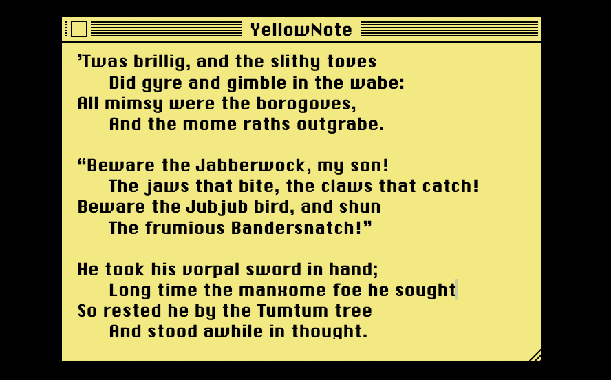

# YellowNote



*A sticky note for macOS, styled after Classic Mac OS.*

Syncs via iCloud Drive so you can run it on multiple machines. Window shades so you can hide it nicely.


YellowNote is a single-file macOS app: one `main.swift`, a build script, and a font. No Xcode project needed. It draws its own window chrome from scratch using raw AppKit to recreate the look of a System 7 notepad.

Your note is saved automatically to iCloud Drive (`~/Library/Mobile Documents/com~apple~CloudDocs/YellowNote.txt`) and syncs across your Macs. Changes from other devices are picked up in real time via file watching.

## Features

- Pinstriped title bar with close box, drawn pixel by pixel
- Chicago bitmap font (the System 7 UI typeface)
- Window shade on double-click (collapses to just the title bar)
- Custom drag-to-resize handle
- Auto-save with 1-second debounce
- iCloud sync via a plain text file
- Remembers window position between launches
- Full Edit menu with undo/redo

## Building

Requires `swiftc` (ships with Xcode or Xcode Command Line Tools).

```
chmod +x build.sh
./build.sh
```

This compiles `main.swift`, then assembles `YellowNote.app` with the binary, `Info.plist`, icon, and font bundled inside.

To run:

```
open YellowNote.app
```

## How it works

The entire app lives in `main.swift`. It bootstraps `NSApplication` manually, creates a borderless `NSWindow`, and hand-draws the title bar, close box, and resize handle. There are no dependencies beyond Cocoa.

See [DESIGN.md](DESIGN.md) for more detail on the drawing approach.

## License

MIT
